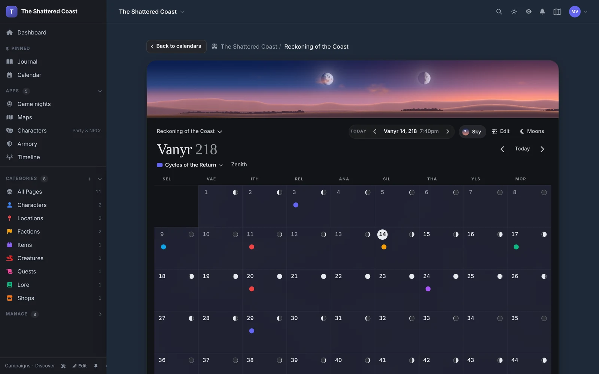
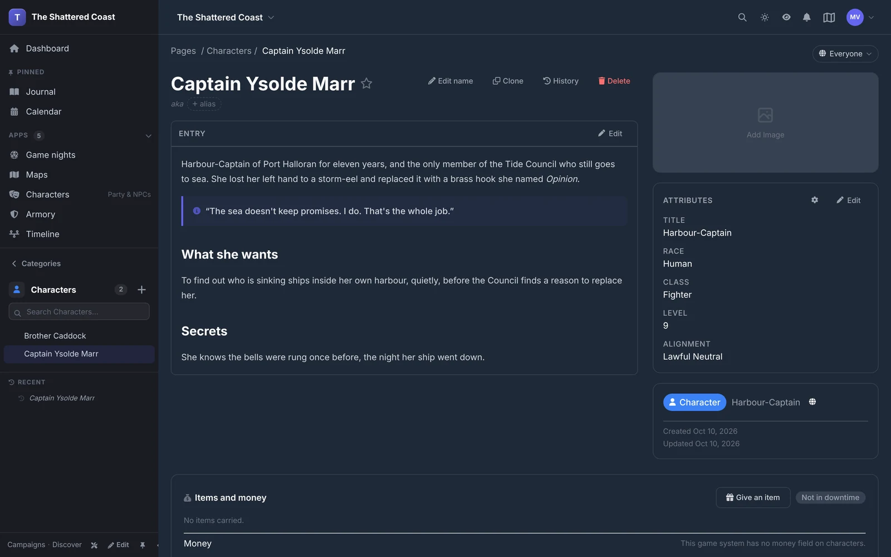
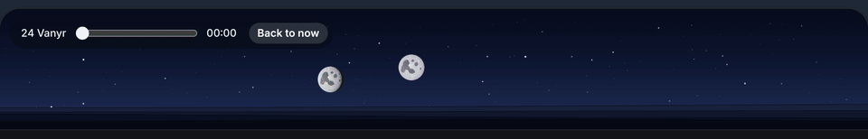
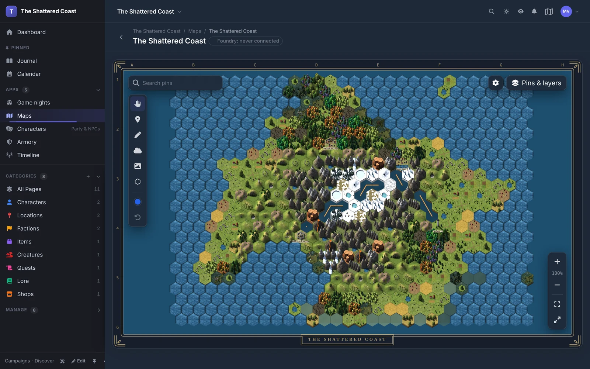
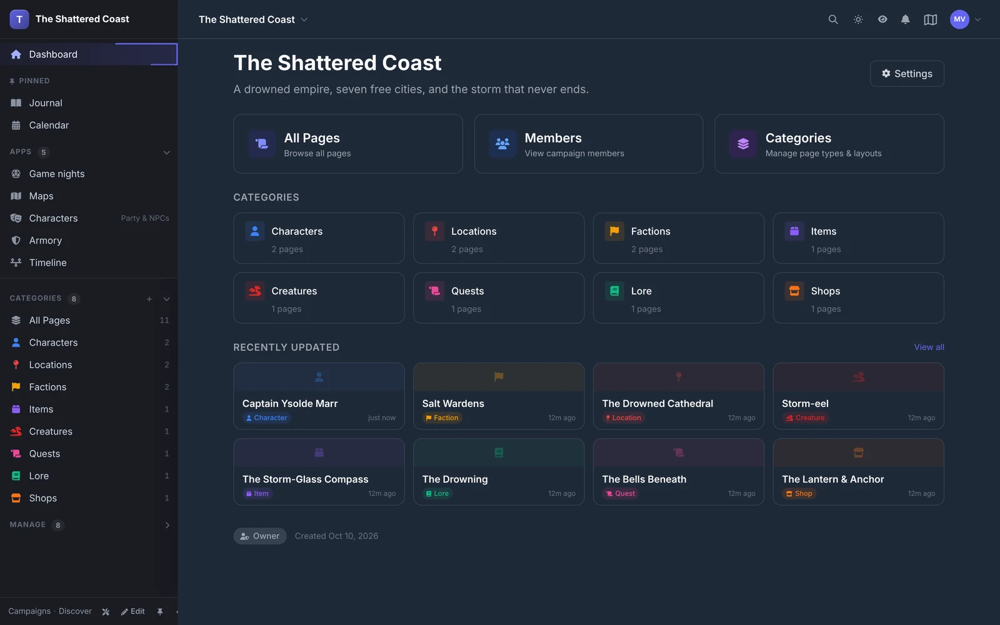

<h1 align="center">Chronicle</h1>

<p align="center">
  <b>A self-hosted home for your tabletop RPG world.</b><br>
  Lore, calendars, maps, shops and game nights for the GM and the players, on your own server.
</p>

<p align="center">
  <a href="LICENSE"></a>
  
  
</p>



Chronicle is built for one table and one world at a time. Nothing is public unless you make it public, there is no paywall, and the data lives in your own MariaDB.

## What it does

### Pages for everything in your world

Characters, places, factions, items, quests: each is a page with a rich-text entry, its own fields, and links to the pages it touches. GM secrets stay hidden from players inside the same page.



### A calendar with a sky

Your own months, weekdays, moons, seasons and eras, or the real-world calendar. Events repeat by rule, weather follows the climate, and the sky over the month shows the world's sun and moons at the hour it is.



### Hex maps you paint

Upload a map picture or paint terrain hex by hex. Pins link to pages, fog of war hides what the party hasn't explored, and a trip planner reads distances off the hexes.



### A campaign home

The dashboard, sidebar and categories are yours to arrange. Members join as Owner, Scribe or Player, and "View as player" shows the campaign exactly as they see it.



### And the rest

- **Timeline**: a zoomable timeline of events, grouped into lanes.
- **Armory, shops and stashes**: item galleries, a walk-in shop room players buy from, and shared party hoards with GM-approved moves.
- **DM Screen**: the party, the world's date and weather, conditions and NPC reveals on one screen.
- **Game nights**: schedule sessions, collect RSVPs and see who's free.
- **Notes**: private and shared notes on any page, with version history; every page keeps its history and deleted pages wait in Trash.
- **Foundry VTT**: the [Chronicle Sync module](https://github.com/keyxmakerx/Chronicle-Foundry-Module) keeps journals, characters, maps, shops and the calendar in step both ways.
- **Game systems**: rules content such as D&D 5e and Draw Steel installs from Admin > Packages.
- **REST API**: per-campaign keys for pages, maps, calendar, media and sync. See [`docs/api/openapi.yaml`](docs/api/openapi.yaml).

## Quick start

With Docker:

```bash
git clone https://github.com/keyxmakerx/chronicle.git
cd chronicle

export SECRET_KEY=$(openssl rand -base64 32)
export DB_PASSWORD=your-secure-password
export MYSQL_ROOT_PASSWORD=your-root-password

docker compose up -d
```

Chronicle is then at http://localhost:8080. The first person to register becomes the site admin. Migrations run on startup.

For production, backups, upgrades and rollback, read [`docs/deployment.md`](docs/deployment.md).

<details>
<summary><b>Run from source</b></summary>

Needs Go 1.27+, MariaDB 10.11+ and Redis 7+ (Node.js only to rebuild the editor bundle).

```bash
git clone https://github.com/keyxmakerx/chronicle.git
cd chronicle
cp .env.example .env    # add your database credentials
make docker-up          # MariaDB + Redis
make generate           # Templ + Tailwind
make dev                # hot reload
```

</details>

## Development

```bash
make help        # every command
make dev         # dev server with hot reload
make test        # all tests
make lint        # golangci-lint
make generate    # regenerate Templ and Tailwind
```

Chronicle is a Go server (Echo, Templ, HTMX) with MariaDB and Redis. Features live in plugins under `internal/plugins/`, game systems install as packages, and reusable UI blocks are widgets under `internal/widgets/`. [`.ai/architecture.md`](.ai/architecture.md) has the full picture.

| Layer | Technology |
|-------|-----------|
| Backend | Go 1.27, [Echo v4](https://echo.labstack.com/) |
| Templates | [Templ](https://templ.guide/) |
| Frontend | [HTMX](https://htmx.org/), [Alpine.js](https://alpinejs.dev/), [Tailwind CSS](https://tailwindcss.com/) |
| Editor | [TipTap](https://tiptap.dev/) |
| Maps and timeline | [Leaflet](https://leafletjs.com/), [D3](https://d3js.org/) |
| Data | MariaDB 10.11, Redis 7 |

## Contributing

Chronicle is pre-alpha. Bug reports and ideas are welcome as [issues](https://github.com/keyxmakerx/Chronicle/issues).

We studied [World Anvil](https://www.worldanvil.com/), [Kanka](https://kanka.io/), [LegendKeeper](https://www.legendkeeper.com/) and [Obsidian](https://obsidian.md/) while building it; Chronicle's design and code are its own.

## License

[GNU Affero General Public License v3.0](LICENSE).

<sub>Screenshots are from a demo campaign running on Chronicle's own code.</sub>
